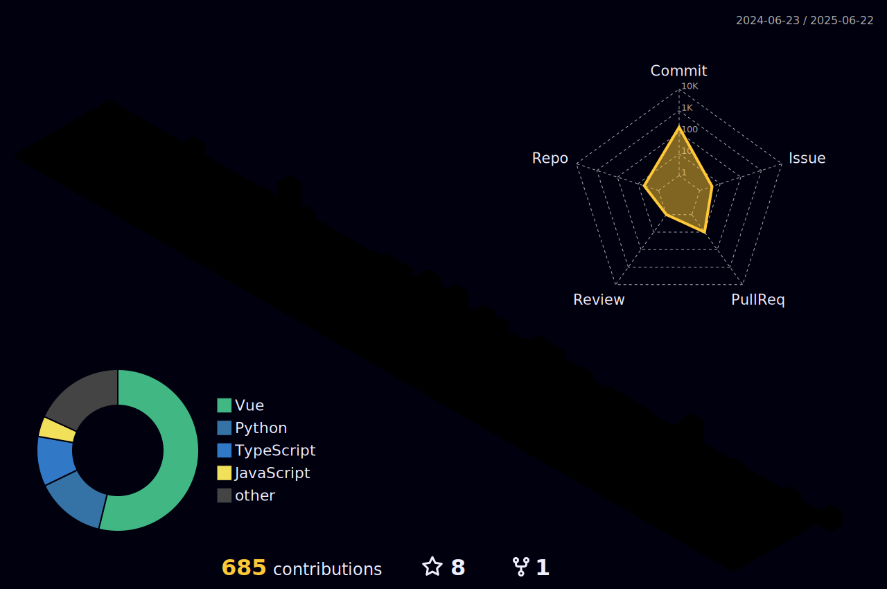

### Heya, im malware
I spend a lot of my free time coding and doing OSINT.


# Introduction
```py
about_me = {
  "name": "mvlware",
  "age": 16,
  "nationality": "swiss",
  "residence": "switzerland",
  "pronouns": "he/him",
  "languages": ["german", "english"],
  "coding_langs": ["Python", "TypeScript", "HTML/CSS"],
  "frameworks": ["VueJS", "FastAPI", "React"],
  "currently_learning": ["Algoritms"]
}


```

# Projects
- Working on SE4L
- Working on some OSINT tools
  
<!--[](https://github.com/mvlwarekekw/mvlware.xyz)-->

# Stats


[](https://github.com/anuraghazra/github-readme-stats)

<!---->
